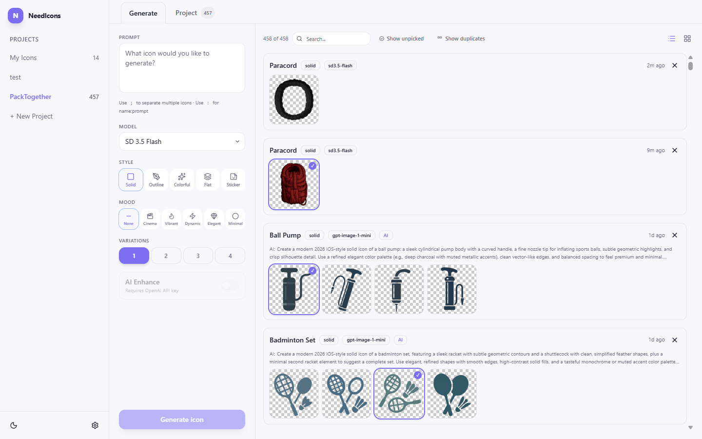
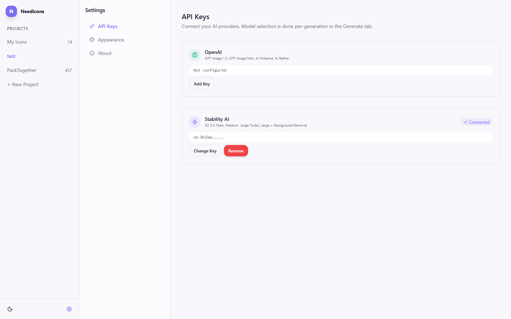
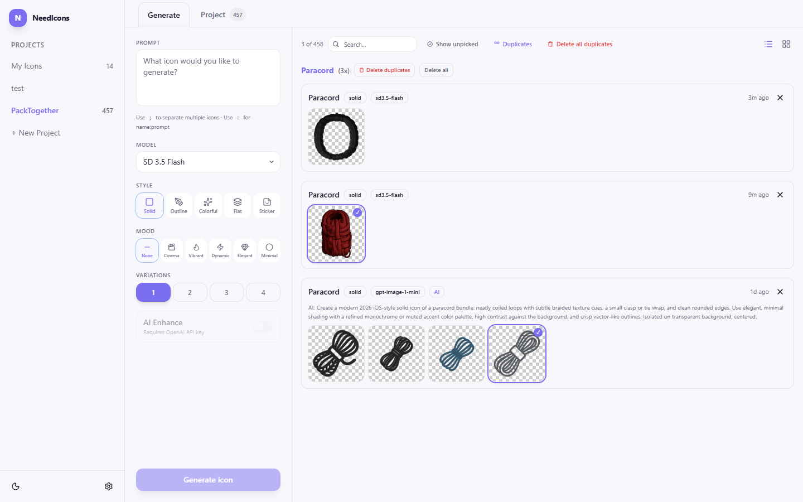
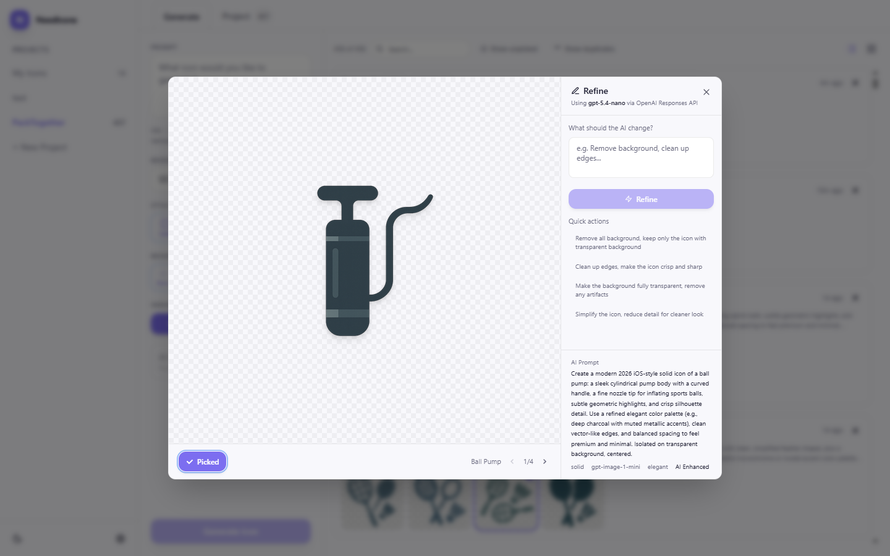
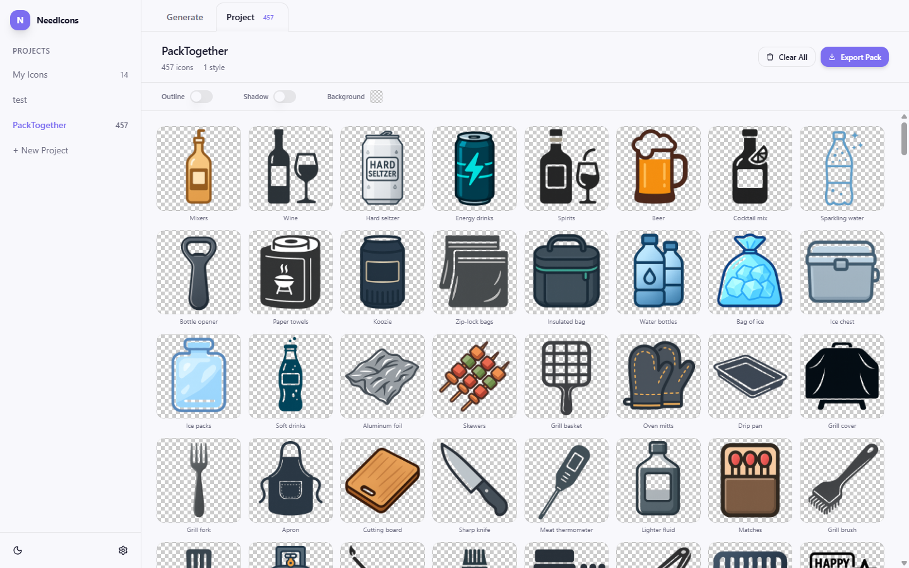

# NeedIcons

AI-powered icon pack generator. Create, refine, and export professional icon sets using multiple AI providers.



## Features

- **Multi-Provider Support** -- Generate with OpenAI (GPT Image 1.5, GPT Image Mini) or Stability AI (SD 3.5 Flash, Medium, Large Turbo, Large)
- **Compare Across Models** -- Generate the same icon with different models and compare results side by side
- **AI Prompt Enhancement** -- Automatically expand prompts into detailed icon descriptions (OpenAI)
- **AI Refine** -- Edit generated icons with natural language instructions (OpenAI)
- **Batch Generation** -- Generate hundreds of icons at once with concurrent API calls and live progress
- **Generation Queue** -- Persistent SQLite-backed queue; failed items can be retried manually
- **Duplicate Detection** -- Warns before regenerating existing names; filter, group, and clean up duplicates
- **Multiple Styles** -- Solid, Outline, Colorful, Flat, Sticker with mood modifiers
- **Variation Control** -- Choose 1-4 variations per icon; click to pick favorites
- **Search & Filter** -- Search by name/prompt, filter unpicked or duplicate entries with relevance ranking
- **Background Removal** -- Via Stability AI API (per-icon or bulk) for icons generated without transparency
- **Multi-Format Export** -- PNG, WebP, SVG in a single ZIP with folder structure
- **SVG Tracing** -- Raster-to-vector via vtracer with smoothing and scour optimization
- **Per-Icon Preview** -- Preview in PNG/WebP/SVG with quality settings and file size
- **React/React Native SVG** -- Export SVGs as React JSX or React Native components
- **Self-Hosted** -- Runs locally, your API keys, your data

## Quick Start

### Prerequisites

- **Python 3.11+**
- An API key from **OpenAI** and/or **Stability AI**

Node.js is **not required** -- the frontend is pre-built in `frontend/dist/`. For development with hot reload, install Node.js 18+.

### Installation

```bash
git clone https://github.com/ashleyleslie1/needicons.git
cd needicons
pip install -e .
```

### Running

```bash
# Production (serves pre-built frontend, no Node.js needed)
python -m needicons

# Development (hot reload for frontend + backend, requires Node.js)
python -m needicons --dev
```

Open [http://localhost:8420](http://localhost:8420) (production) or [http://localhost:5173](http://localhost:5173) (dev).

### First-Time Setup

1. Go to **Settings** (gear icon in sidebar)
2. Enter your **OpenAI** and/or **Stability AI** API key
3. Go to **Generate** tab -- available models appear based on which keys are configured
4. Type a prompt and click **Generate**



## Usage

### Generating Icons

Type icon names separated by `;` for multiple icons:

```
house; tree; car; bicycle
```

Use `:` for custom prompts per icon:

```
house: red cottage with chimney; tree: tall oak with leaves
```

| Option | Description |
|--------|-------------|
| **Model** | Choose from available providers -- only models with active API keys are shown |
| **Style** | Solid, Outline, Colorful, Flat, Sticker |
| **Mood** | Minimal, Cinematic, Energetic, Bold, Elegant, Soft |
| **Quality** | Auto, High, Medium, Low (OpenAI only) |
| **Variations** | 1-4 variations generated per icon |
| **AI Enhance** | Rewrites your prompt for better results (requires OpenAI) |

### Comparing Models

Generate the same icon with different models to compare quality and style. Use the duplicates filter to see all generations of the same icon grouped together -- useful for comparing results between OpenAI and Stability AI side by side.



### Picking & Filtering

- **Click** any variation to pick it as your favorite
- **Hover** to reveal the **View** button for detail/refine modal
- **Search** by icon name or prompt text (results ranked by relevance)
- **Show unpicked** to find icons without a selection
- **Show duplicates** to see icons generated multiple times, grouped by name with delete actions

### AI Refine (OpenAI)

Hover over a variation and click **View** to open the detail modal. For OpenAI-generated icons, type natural language instructions to refine:

- *"Remove the background"*
- *"Clean up edges, make it crisp"*
- *"Simplify the design"*

Quick action presets are available for common operations.



### Project & Export

1. **Pick** your favorite variations (click the image)
2. Switch to the **Project** tab
3. Click **Export Pack** to download a ZIP



| Setting | Values |
|---------|--------|
| **Sizes** | 1024, 512, 256, 128, 64, 32, 16px |
| **Formats** | PNG, WebP, SVG (all selectable) |
| **SVG Smoothing** | 1-5 |
| **SVG Optimize** | Scour minification |

ZIP structure:
```
needicons-MyProject.zip
  png/1024/house.png
  png/512/house.png
  webp/1024/house.webp
  svg/house.svg
  manifest.json
```

## Providers

| Provider | Models | Transparent BG | AI Enhance | AI Refine |
|----------|--------|---------------|------------|-----------|
| **OpenAI** | GPT Image 1.5, GPT Image Mini, DALL-E 3 | Native | Yes | Yes |
| **Stability AI** | SD 3.5 Flash, Medium, Large Turbo, Large | Via BG removal API | No | No |

Both providers can be active simultaneously -- switch between models per generation.

## Tech Stack

| Layer | Technology |
|-------|-----------|
| **Backend** | Python 3.11+, FastAPI, Uvicorn |
| **AI** | OpenAI API, Stability AI API |
| **Image Processing** | Pillow, NumPy, OpenCV |
| **SVG** | vtracer, scour |
| **Storage** | SQLite (WAL mode) |
| **Frontend** | React 18, TypeScript, Vite |
| **Styling** | Tailwind CSS |
| **Components** | shadcn/ui, Radix UI, lucide-react |
| **Data Fetching** | TanStack Query |

## Configuration

All data stored locally in `~/.needicons/`:

| File | Purpose |
|------|---------|
| `config.yaml` | API keys (encrypted at rest via Fernet), provider settings |
| `needicons.db` | SQLite database |
| `images/` | Generated icon images |

## Development

```bash
pip install -e ".[dev]"
cd frontend && npm install && cd ..

python -m needicons --dev

# Tests
python -m pytest

# TypeScript check
cd frontend && npx tsc --noEmit
```

## License

AGPL-3.0 -- see [LICENSE](LICENSE)
